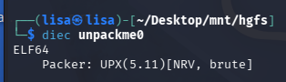
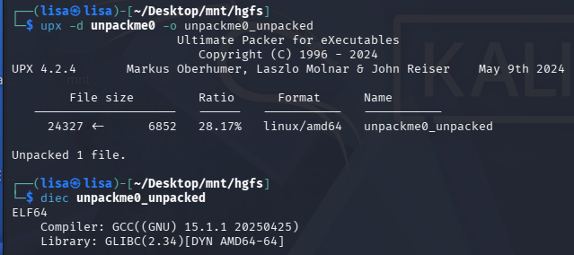
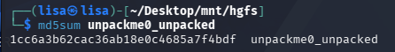

# About The Challenge:
This challenge involves analyzing a packed Linux binary, identifying the packer used, successfully unpacking it, and generating a verification hash.
Skills: Reverse Engineering / Malware Analysis

## 📌 Description
The binary was packed with UPX (Ultimate Packer for eXecutables) version 5.11 using NRV compression. Our task is to reverse this compression using Linux tools until we recover the original unpacked binary and verify its integrity.

## 🛠️ Tools Used
* **diec** (Detect It Easy - console): Packer identification
* **upx**: Binary unpacking/decompression
* **md5sum**: Hash generation for verification

---

### Step 1 — Identify the Packer
**Why:**
Before unpacking, we need to know what packer was used to compress or obfuscate the binary.

**What happens:**
Using `diec`, we scan the file. The finding reveals the binary is an ELF64 executable packed with UPX 5.11 using NRV compression.

### Step 2 — Unpack the Binary
**Why:**
We need to decompress the binary to analyze its original contents. UPX provides a built-in decompression feature.

**What happens:**
By passing the `-d` flag, UPX successfully decompresses the binary. The file expanded from 6,852 bytes (packed) to 24,327 bytes (unpacked).

### Step 3 — Verify Unpacking Success
**Why:**
We must confirm that the unpacking was successful and that no packer artifacts remain.

**What happens:**
Scanning the new file with `diec` again shows no packer detected. The binary now displays legitimate GCC compilation artifacts.

### Step 4 — Generate Verification Hash
**Why:**
We need a cryptographic fingerprint to verify the file and for future reference.

**What happens:**
We use `md5sum` to calculate the hash of our unpacked binary.

## 🧠 Skills Gained

### Technical Skills
* **🔍 Packer Detection:** Using `diec` to identify UPX packer signatures, compression algorithms (NRV), and version information.
* **📦 UPX Unpacking:** Command-line decompression of UPX-packed ELF binaries with the `-d` flag.
* **✅ Verification:** Confirming successful unpacking by re-scanning with `diec` to ensure no remaining packer artifacts.
* **🔐 File Hashing:** Generating cryptographic MD5 hashes with `md5sum` for file fingerprinting.
* **🏗️ ELF Structure:** Recognizing ELF64 format and compiler signatures (GCC, GLIBC).

## 📚 Key Takeaways
1. **UPX is a reversible packer:** What compresses can decompress.
2. **Packed ≠ Encrypted:** UPX is compression, not cryptography.
3. **High compression ratios:** Ratios like 28% strongly suggest packing.
4. **MD5 hashes:** Provide unique fingerprints for malware sample tracking.
