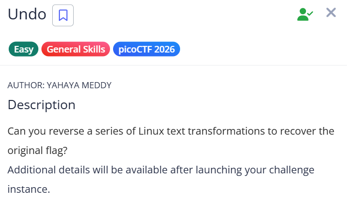
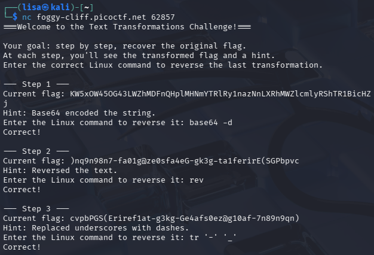
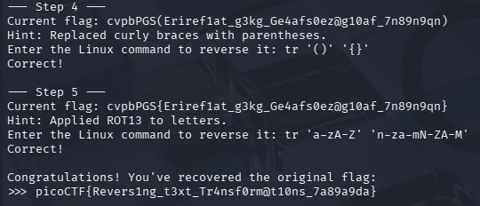

Date: 2/4/2026
# About The Challenge:
This challenge involves a series of step-by-step text transformations. The goal is to identify and execute the correct Linux commands to reverse each transformation until the original flag is recovered.
Skills: General Skills/ Encoding


## 📌 Description
We are given a remote challenge that applies multiple transformations to a flag.
Our task is to reverse each transformation step-by-step using Linux commands until we recover the original flag.

## 🔗 Connection
```bash```
nc foggy-cliff.picoctf.net 62857


### Step 1 — Base64 Decode
Why:

The string only contains characters from the Base64 charset (A–Z, a–z, 0–9, +, /).
It also has a length divisible by 4 → strong indicator of Base64 encoding.
Base64 is commonly used in CTFs to “hide” readable text.

What happens:
Base64 converts binary → text.
So decoding (-d) converts it back to the original readable string.

### Step 2 — rev
Why:
The decoded string looks like readable characters but in the wrong order.
The hint explicitly says it's reversed.
Patterns like ) ... ( instead of { ... } suggest flipped structure.

What happens:
rev reverses the entire string character-by-character.
This restores the correct sequence.

### Step 3 — tr '-' '_'
Why:
Flags in picoCTF usually follow a format like:

picoCTF{something_like_this}
Seeing - instead of _ is suspicious because underscores are standard in flags.
The hint confirms substitution happened.

What happens:
tr replaces all - with _, restoring the expected flag format.



### Step 4 — tr '()' '{}'

Why:
CTF flags almost always use curly braces {}, not parentheses ().

After reversing earlier steps, we see something like:
cvpbPGS(...)
This structure strongly resembles a flag but with wrong brackets.

What happens:
tr '()' '{}' maps:
( → {
) → }
This restores the proper flag structure.

### Step 5 — tr 'a-zA-Z' 'n-za-mN-ZA-M' (ROT13)

Why:
The string:
cvpbPGS{Eriref1at...}

looks almost readable but slightly “off”.
cvpbPGS is a known pattern — it decodes to picoCTF using ROT13.
ROT13 is common in beginner CTF challenges because:
It’s simple
It’s reversible using the same operation

What happens:
ROT13 shifts each letter by 13 positions in the alphabet.
Applying it again reverses the transformation (symmetric cipher).

```flag: picoCTF{Revers1ng_t3xt_Tr4nsf0rm@t10ns_7a89a9da} ```
