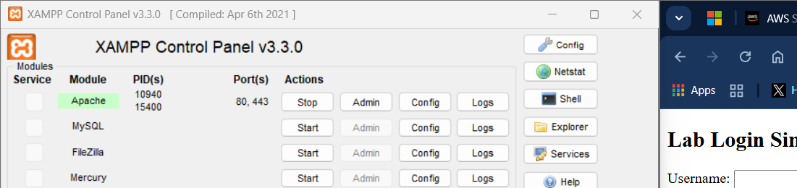
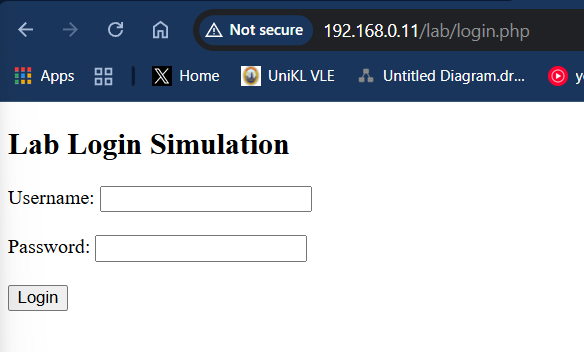
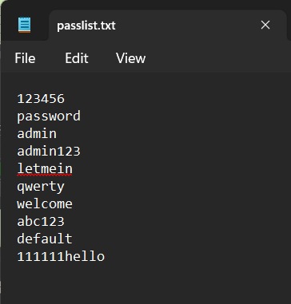
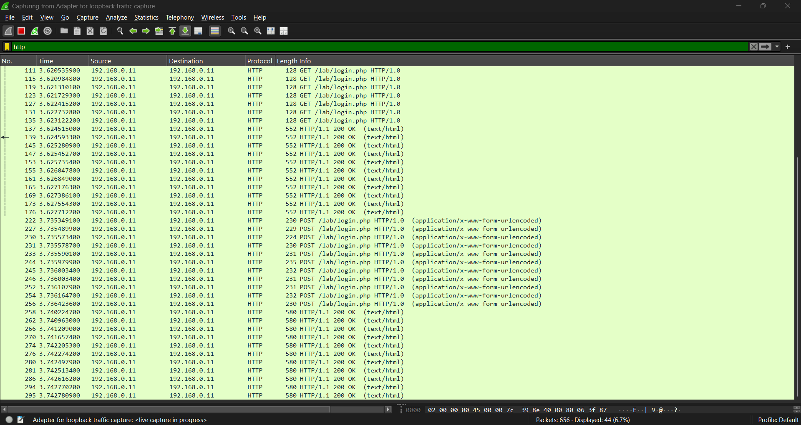
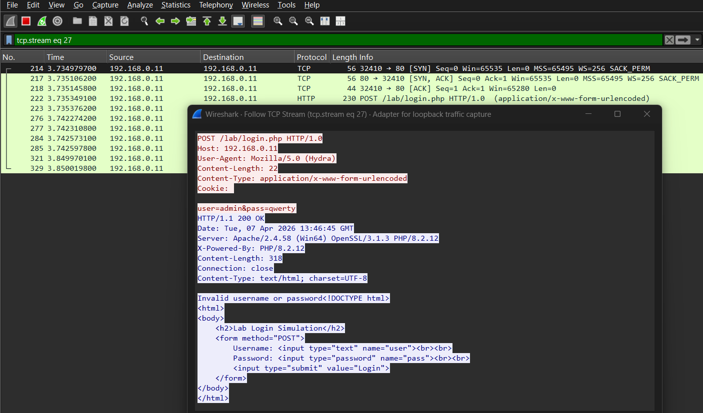

# Simulation and Traffic Analysis of an Automated Brute-Force Attack in a Local Loopback Environment

## 3.1 Attack Scenario
In this scenario, a brute-force attack was simulated on a web-based login system. The simulation utilized a loopback configuration where the machine (laptop) 192.168.0.11 acted as both the attacker and the victim. The attack was executed using Hydra which targets the PHP-based login script (login.php) hosted on an Apache web server via XAMPP. Then, a common password list which is passlist.txt was created then used to attempt unauthorized access to the 'admin' account.

*Figure 3.1.1. Starting the Apache web server via XAMPP.*

*Figure 3.1.2. PHP-based login script (login.php)*

*Figure 3.1.3. List of common password Passlist.txt*

---

## 3.2 Traffic Capture (Wireshark)
The traffic on the network was captured using Wireshark which targets the Npcap Loopback Adapter to intercept internal traffic. An HTTP display filter was applied to filter the relevant packets.

### 3.2.1 Wireshark Packet Capture
The capture reveals a rapid sequence of HTTP POST requests. The source and destination are both identified as 192.168.0.11, communicating over port 80. Multiple POST requests are visible within a single second, which means an automated attack happened.

*Figure 3.2.1 Wireshark packets captured*

### 3.2.2 HTTP Login Request Packet
Each attack packet used the POST method to submit credentials to /lab/login.php. The data was encapsulated using application/x-www-form-urlencoded, which is the standard format for web form submissions.

### 3.2.3 TCP Stream Analysis
After that, I followed the TCP stream which is Stream 27 to see the clear view of the "Request and Response" cycle. Requests happen when the attacker sends a POST request with the payload `user=admin&pass=qwerty`. The User-Agent was explicitly identified as Mozilla/5.0 (Hydra). The Respond is when the server replies with an HTTP/1.1 200 OK status. However, the response body contained the string "Invalid username or password," confirming that the authentication attempt failed and was correctly rejected by the server logic.

*Figure 3.2.3 Stream 27 packet*

---

## 3.3 Analysis
The simulation successfully demonstrated the mechanics of a brute-force attack in a controlled environment. The "User-Agent" header shows that the attacks used a tool called Hydra, which basically announced itself to the server. Because the tool didn't try to hide its name, any basic security system or server log could instantly flag this traffic as a bot rather than a real person using a web browser.

The data capture revealed a very specific pattern used during the attack. The attacks kept the username admin account, while the password field kept changing. This shows how the software moves through a wordlist, testing all available combinations in a short period. These attempts are a primary indicator of a brute-force method.

This simulation relied on standard HTTP, which lacks encryption. As a result, every credential sent during the attack was transmitted in plain text. Anyone with access to the network traffic could read the passwords directly without needing to decrypt them. This highlights a major security risk, as sensitive data is fully exposed when modern security certificates are not used.

The speed of the attack was a major factor, with multiple packets being sent every few milliseconds. This level of activity is impossible for a human user and confirms the use of automation. While the attack used HTTP POST requests to keep passwords out of the URL, the credentials remained fully visible within the body of the packets.

Throughout the process, the server consistently returned a 200 OK status. However, the response body always included an "Invalid" message, which proves the security logic was functioning correctly by rejecting the fake credentials.

---

## 3.4 Supplemental Lab Notes

### Packet Breakdown and Interpretation
The following table explains the specific packet types observed during the lab and their significance in the attack cycle.

| Packet Length | Type / Info | Lab Significance |
| :--- | :--- | :--- |
| **128** | GET /lab/login.php | This is the "Safe" request. I (the browser) am simply asking the server to show the login page. No password data is sent here. |
| **230 - 235** | POST /lab/login.php | This is the Attack. Hydra is "pushing" (POSTing) a username and password to the server. The length varies because some passwords are longer than others. |
| **550 - 586** | HTTP/1.1 200 OK | This is the Server's Answer. It contains the HTML of the page. Because the script sends back "Invalid username or password," the packet is larger than the request. |

### Technical Distinction: TCP vs. HTTP Streams
In Wireshark, I observed options for both stream types. Their technical roles are defined as follows:

* **TCP Stream:** This shows the entire raw conversation from the moment the connection starts (SYN) to the moment it ends (FIN). It includes all the "handshaking" and retransmissions. It is the most complete view for a network security report.
* **HTTP Stream:** This is a "cleaned up" version. It strips away the TCP headers and only shows the application-layer data, such as the website text and headers.

## 3.5 Knowledge Gained
After finishing this lab, I learned several important things:
1. **Network Visibility:** I learned how to use Wireshark to see exactly what is happening inside a network.
2. **Plain Text Risks:** I saw how easy it is to steal passwords if a website does not use encryption (HTTPS).
3. **Spotting Bots:** I learned how to identify bot traffic by looking at the "User-Agent" and the speed of the requests.
4. **Server Logic:** I learned that a "200 OK" message does not always mean a login was successful; you have to check the message inside.
5. **Tool Mechanics:** I now understand how automated tools like Hydra work to guess passwords rapidly.
