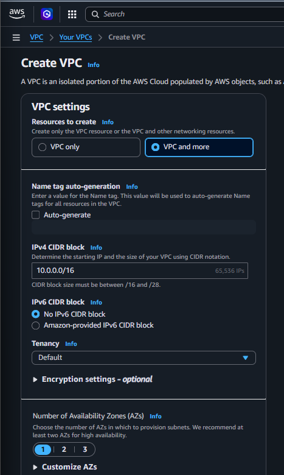
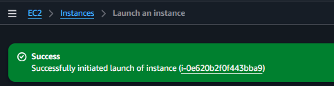
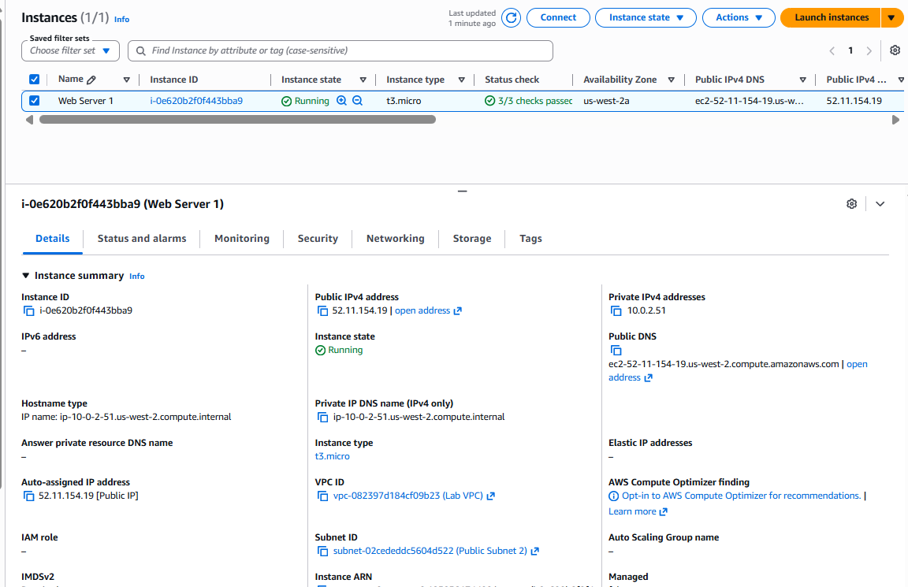
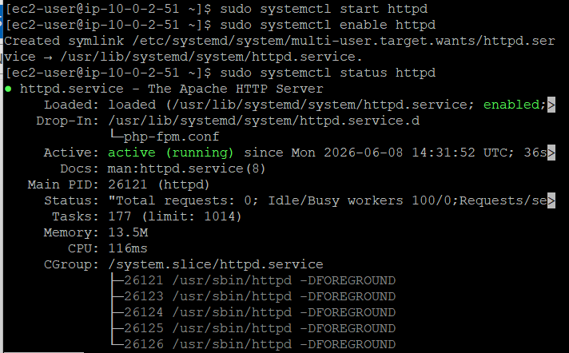
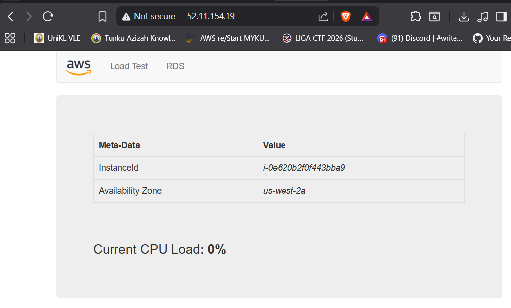

```markdown
# Build VPC, Launch a Web Server & Troubleshoot Real-World Cloud Deployment Issues ☁️

## 📌 Overview

This lab demonstrates the deployment of a custom AWS Virtual Private Cloud (VPC) environment with public and private networking components, security controls, routing infrastructure, and an Apache web server hosted on Amazon EC2.

The project covers cloud network architecture design, subnet segmentation, route propagation, security group configuration, and infrastructure deployment.

During implementation, an unexpected User Data automation failure was encountered. A Root Cause Analysis (RCA) was performed and a manual remediation process was executed to restore service availability.

---

# 🏗️ Architecture Overview

## Architecture Components

| Component        | Configuration      |
| ---------------- | ------------------ |
| VPC              | 10.0.0.0/16        |
| Public Subnet 1  | 10.0.0.0/24        |
| Private Subnet 1 | 10.0.1.0/24        |
| Public Subnet 2  | 10.0.2.0/24        |
| Private Subnet 2 | 10.0.3.0/24        |
| Internet Gateway | Attached           |
| NAT Gateway      | Single NAT Gateway |
| Security Group   | HTTP (80) Allowed  |
| EC2 Instance     | Amazon Linux 2     |
| Web Server       | Apache HTTP Server |

## Architecture Diagram

<div align="center">

</div>

## Expected Architecture

```text
Internet
    |
Internet Gateway
    |
Public Route Table
    |
+---------------------+
| Public Subnet 1     |
+---------------------+

+---------------------+
| Public Subnet 2     |
| EC2 Web Server      |
+---------------------+

        |
    NAT Gateway
        |

+---------------------+
| Private Subnet 1    |
+---------------------+

+---------------------+
| Private Subnet 2    |
+---------------------+
```

---

# 🚀 Task 1 — Build the VPC Infrastructure

## Objective

Create a custom AWS network environment consisting of public and private subnets, route tables, internet connectivity components, and supporting infrastructure.

## Activities

* Created a custom VPC (`Lab VPC`) using CIDR block `10.0.0.0/16`.
* Created Public Subnet 1 (`10.0.0.0/24`).
* Created Private Subnet 1 (`10.0.1.0/24`).
* Created Public Subnet 2 (`10.0.2.0/24`).
* Created Private Subnet 2 (`10.0.3.0/24`).
* Attached an Internet Gateway to the VPC.
* Provisioned a NAT Gateway for outbound internet access from private subnets.
* Created Public and Private Route Tables.
* Associated public and private subnets with their respective route tables.

## Screenshots

### VPC Configuration

<div align="center">

</div>

### Subnet Creation

<div align="center">

</div>

### Route Table Associations

<div align="center">

</div>

### NAT Gateway Configuration

<div align="center">

</div>

---

# 🔐 Task 2 — Configure Security Controls

## Objective

Implement network-level access control using AWS Security Groups.

## Activities

* Created a custom Security Group named `Web Security Group`.
* Allowed inbound HTTP traffic on TCP Port 80.
* Configured source as `0.0.0.0/0`.
* Attached the Security Group to the EC2 instance.

## Security Configuration

| Protocol | Port | Source    |
| -------- | ---- | --------- |
| HTTP     | 80   | 0.0.0.0/0 |

## Screenshot

### Security Group Rules

<div align="center">

</div>

---

#  Task 3 — Launch the EC2 Web Server

## Objective

Deploy an Apache web server inside the custom VPC environment.

## Activities

* Launched Amazon Linux 2 EC2 instance.
* Selected Public Subnet 2.
* Assigned Public IPv4 address.
* Attached Web Security Group.
* Used EC2 User Data to automate web server installation and deployment.

## Screenshots

### Running EC2 Instance

<div align="center">

</div>

### Instance Status Checks

<div align="center">

</div>

---

# 🛠️ Task 4 — Incident Response & Root Cause Analysis

## Objective

Investigate why the deployed web application was inaccessible despite successful infrastructure provisioning.

## Initial Observation

The EC2 instance was running successfully.

All infrastructure components appeared healthy:

* VPC operational
* Internet Gateway attached
* Security Group configured correctly
* Public IP assigned
* Route Tables configured correctly

However, the web application failed to load.

### Browser Error

<div align="center">

</div>

---

## Root Cause Analysis (RCA)

Using EC2 Instance Connect, I accessed the instance terminal and investigated the Apache service.

```bash
sudo systemctl status httpd
```

Output:

```bash
Unit httpd.service could not be found.
```

Investigation revealed that the provided User Data script failed during package installation.

### Root Cause

The automation script attempted to install a deprecated package:

```bash
yum install -y httpd mysql php
```

The `mysql` package is no longer available in modern Amazon Linux 2 repositories.

This resulted in:

1. Package installation failure.
2. User Data execution interruption.
3. Apache not installed.
4. Website files not downloaded.
5. Web service unavailable.

---

# 🔧 Manual Remediation

## Step 1 — Install Required Packages

```bash
sudo yum install -y httpd php
```

## Step 2 — Download Application Files

```bash
sudo wget https://aws-tc-largeobjects.s3.us-west-2.amazonaws.com/CUR-TF-100-RESTRT-1/267-lab-NF-build-vpc-web-server/s3/lab-app.zip
```

## Step 3 — Extract Application

```bash
sudo unzip lab-app.zip -d /var/www/html/
```

## Step 4 — Start Apache

```bash
sudo systemctl start httpd
sudo systemctl enable httpd
```

---

## Remediation Evidence

### Terminal Investigation

<div align="center">

</div>

### Apache Service Running

<div align="center">

</div>

### Successful Web Application Deployment

<div align="center">

</div>

---

# 🔒 Security Analysis

## Public Subnets

Public subnets host internet-facing resources and contain routes pointing to the Internet Gateway.

## Private Subnets

Private subnets are isolated from direct internet access and can only communicate externally through the NAT Gateway.

## Security Groups

AWS Security Groups provide stateful firewall protection and restrict inbound traffic to approved protocols and ports.

## NAT Gateway

The NAT Gateway allows outbound internet connectivity for resources located in private subnets while preventing direct inbound access.

---

# 🧠 Skills Gained

* AWS VPC Design and Deployment
* Public and Private Subnet Architecture
* Route Table Configuration
* Internet Gateway & NAT Gateway Deployment
* Security Group Administration
* Amazon EC2 Deployment
* Linux System Administration
* Incident Response & Troubleshooting
* Root Cause Analysis (RCA)
* Apache Web Server Management
* Cloud Infrastructure Security

---

# ✅ Conclusion

This lab provided hands-on experience in designing and deploying a complete AWS networking environment while demonstrating the importance of troubleshooting cloud automation failures.

Beyond infrastructure deployment, the exercise reinforced the need for systematic investigation, service validation, and manual remediation techniques when automated provisioning mechanisms fail. The combination of networking, security, and incident response activities reflects practical cloud engineering and cloud security operations skills commonly required in production environments.
