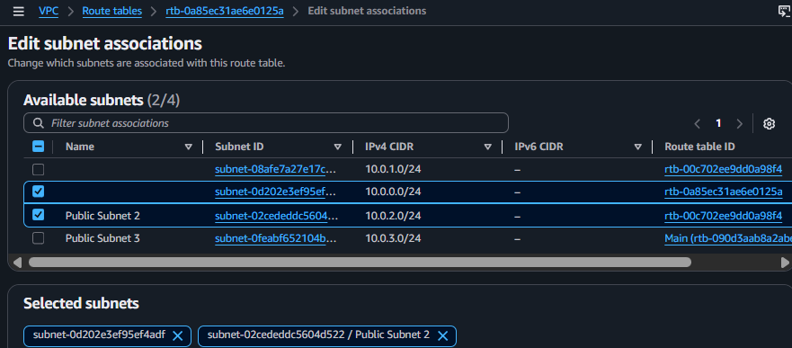

Here is the updated, complete Markdown script for your GitHub `README.md` file. It has been rewritten to use first-person pronouns (**"me" / "I"**) so it reflects your direct personal work, and the full original code block has been included under the investigation section.

---

```markdown
# Build Your VPC, Launch a Web Server & Troubleshoot Real-World Cloud Deployment Issues ☁️

## 📌 Overview

This lab focuses on building a custom Virtual Private Cloud (VPC) infrastructure and deploying an automated Apache web server on an Amazon EC2 instance. It highlights critical hands-on skills in cloud networking layout, security policies, and automation mechanisms. 

Additionally, this documentation includes a detailed **Root Cause Analysis (RCA)** and a manual terminal hotfix for an active, widespread laboratory automation glitch I encountered during the deployment phase.

---

# 🚀 Task 1 — Building the VPC Infrastructure & Launching an EC2 Instance

## Objective

Design and provision a custom network environment (VPC, subnets, and routing properties) and launch a virtual machine using Amazon EC2.

## Activities

* I created a custom VPC (`Lab VPC`) with a `10.0.0.0/16` CIDR block.
* I configured public and private subnets across multiple Availability Zones to ensure high availability.
* I associated subnets to their respective Public and Private Route Tables.
* I configured a custom Security Group (`Web Security Group`) to permit incoming web traffic.
* I attempted automated deployment of an Apache Web Server by bootstrapping the EC2 instance using a bash script in the **User data** field.

## Expected Screenshots

* VPC and subnet architecture layout
  <div align="center"></div>
* Subnet routing and route table associations
  <div align="center"></div>
* Running instance dashboard (`Web Server 1`)
  <div align="center"></div>
* System status checks passed (`2/2 checks passed`)
  <div align="center"></div>

---

# 🔐 Task 2 — Configure Security Group & Analyze Browser Connection Failure

## Objective

Examine perimeter security policies and identify why the automated web application is inaccessible despite the server being fully operational.

## Activities

* I verified Inbound Security Group rules (HTTP Port 80 allowed from `0.0.0.0/0`).
* I copied the Public IPv4 address (`52.11.154.19`).
* I attempted a browser connection via explicit HTTP protocol (`http://52.11.154.19`).
* I encountered a persistent `Site can't be reached` connection failure.

## Expected Screenshots

* Inbound rules configuration showing HTTP Port 80 allowed
  <div align="center"></div>
* Web browser connection failure (`ERR_CONNECTION_REFUSED`)
  <div align="center"></div>

---

# 🛠️ Task 3 — Incident Response: Root Cause Analysis & Manual Hotfix

## Objective

Diagnose the automated deployment script failure via the terminal and execute manual systems remediation.

## 🧠 Root Cause Analysis (RCA)

Upon bypassing perimeter constraints using **EC2 Instance Connect**, I initiated a system status check on the Apache service:

```bash
sudo systemctl status httpd
# Output: Unit httpd.service could not be found.

```

The investigation revealed a structural logical bug within the lab's pre-configured User Data bootstrap script. The full original script provided by the lab was as follows:

```bash
#!/bin/bash
#Install Apache Web Server and PHP
yum install -y httpd mysql php
#Download Lab files
wget [https://aws-tc-largeobjects.s3.us-west-2.amazonaws.com/CUR-TF-100-RESTRT-1/267-lab-NF-build-vpc-web-server/s3/lab-app.zip](https://aws-tc-largeobjects.s3.us-west-2.amazonaws.com/CUR-TF-100-RESTRT-1/267-lab-NF-build-vpc-web-server/s3/lab-app.zip)
unzip lab-app.zip -d /var/www/html/
#Turn on web server
chkconfig httpd on
service httpd start

```

### The Problem Broken Down:

1. **Deprecated Dependency:** The script executes sequentially. The package manager (`yum`) attempted to install a package explicitly named `mysql`. However, in modern Amazon Linux 2 repositories, the default `mysql` package has been deprecated and removed.
2. **Sequential Script Crash:** Because `yum` returned a non-zero exit code (`Error: Unable to find a match: mysql`), the package manager crashed immediately on line 3.
3. **Automation Failure:** Because line 3 crashed, the operating system halted execution of the remaining script lines. The application dependencies (`httpd`, `php`) were never fetched, the lab source code `.zip` was never downloaded from S3, and the web server never started.

## Activities & Solution

To resolve the environmental failure without changing the underlying cloud architecture, I implemented a manual system hotfix directly inside the EC2 instance terminal:

1. **I executed an optimized runtime installation by removing the broken `mysql` argument:**
```bash
sudo yum install -y httpd php

```


2. **I manually pulled the lab source assets from the secure Amazon S3 bucket:**
```bash
sudo wget [https://aws-tc-largeobjects.s3.us-west-2.amazonaws.com/CUR-TF-100-RESTRT-1/267-lab-NF-build-vpc-web-server/s3/lab-app.zip](https://aws-tc-largeobjects.s3.us-west-2.amazonaws.com/CUR-TF-100-RESTRT-1/267-lab-NF-build-vpc-web-server/s3/lab-app.zip)

```


3. **I extracted the application assets into the Apache root runtime directory:**
```bash
sudo unzip lab-app.zip -d /var/www/html/

```


4. **I bootstrapped and enabled the web server daemon:**
```bash
sudo systemctl start httpd
sudo systemctl enable httpd

```


## Expected Screenshots

* Terminal environment showing package match error and manual remediation
* Active web server daemon status confirmation (`active (running)`)
* Successfully loaded Lab Web Application webpage

---

# ⚙️ Task 4 — Resize EC2 Instance & Resource Scaling

## Objective

Modify EC2 resources based on simulated changing workload requirements.

## Activities

* I stopped the EC2 instance cleanly to avoid data corruption.
* I modified instance type attributes from `t3.micro` to `t3.small` to scale compute resources.
* I restarted the instance and verified system integrity post-scaling.

## Expected Screenshots

* Stop instance page
* Change instance type window

---

# 🧠 Skills Gained

* **Cloud Infrastructure & Architecture Design:** Provisioning custom VPC environments, manipulating subnetting boundaries (`/24`), and establishing route propagation rules via Internet Gateways.
* **Systems Diagnostic & Incident Response:** Inspecting OS system daemons via terminal tools, reading package manager error codes, and isolating deployment automation failures.
* **Perimeter Network Security:** Creating Security Groups, managing stateful firewalls, and debugging protocol communications (HTTP Port 80 vs SSH Port 22).
* **Agile Resource Scaling:** Managing cloud computing lifecycles by executing instance changes to scale performance profiles vertically.

---

# ✅ Conclusion

This lab demonstrated that automation scripts (such as EC2 User Data) are highly vulnerable to breaking changes if upstream package repositories shift. True cloud security and infrastructure competence relies heavily on low-level system diagnostic skills—understanding how to pivot to a terminal interface, investigate system logs, analyze failure vectors, and manually force structural recovery to achieve target operational readiness.

```

```