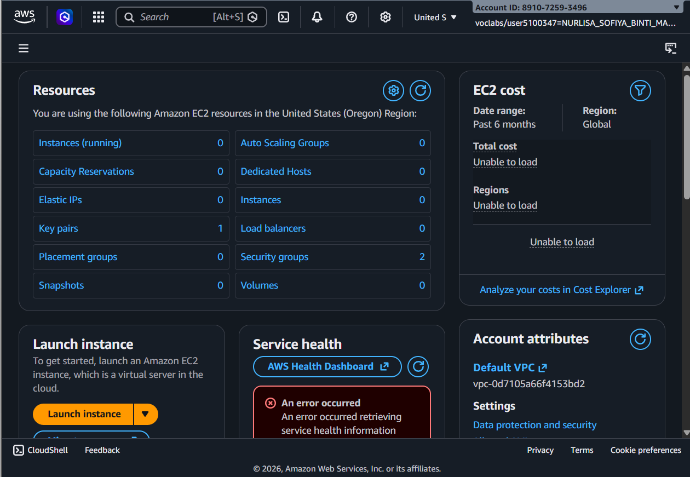
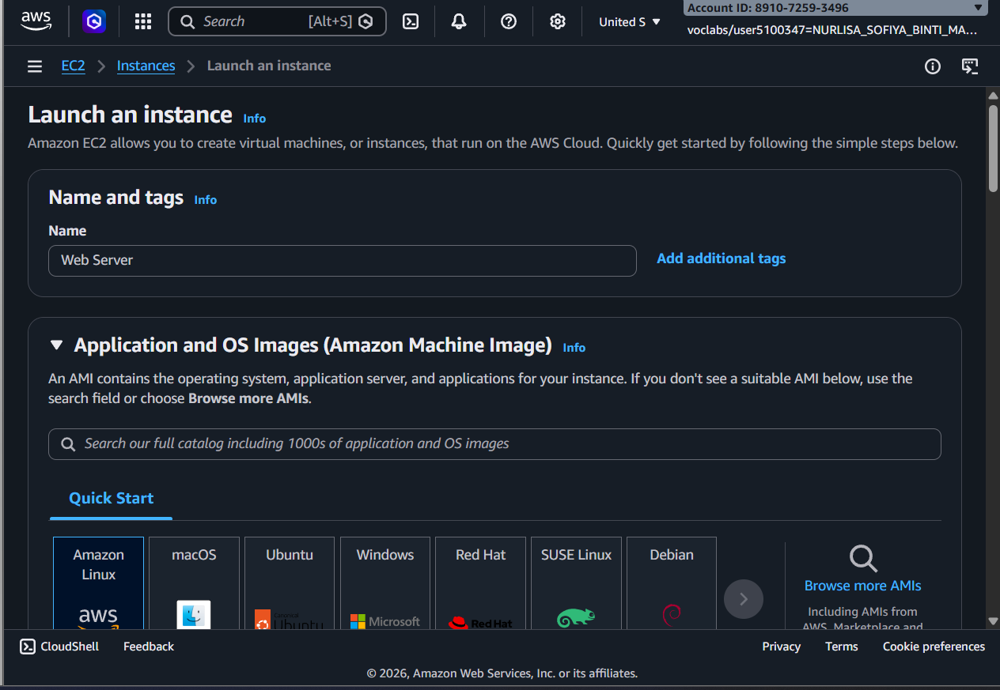
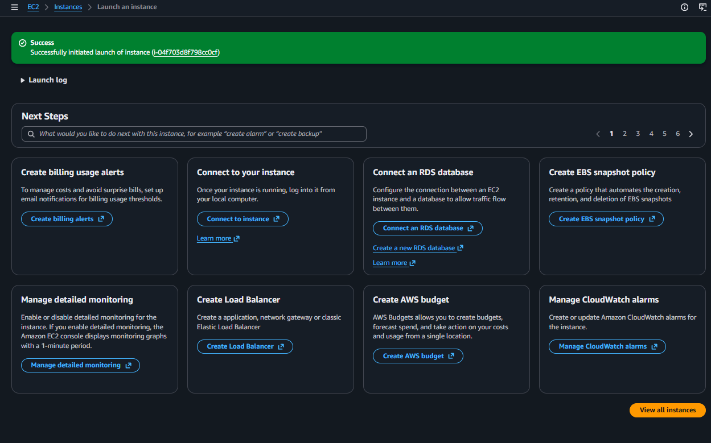
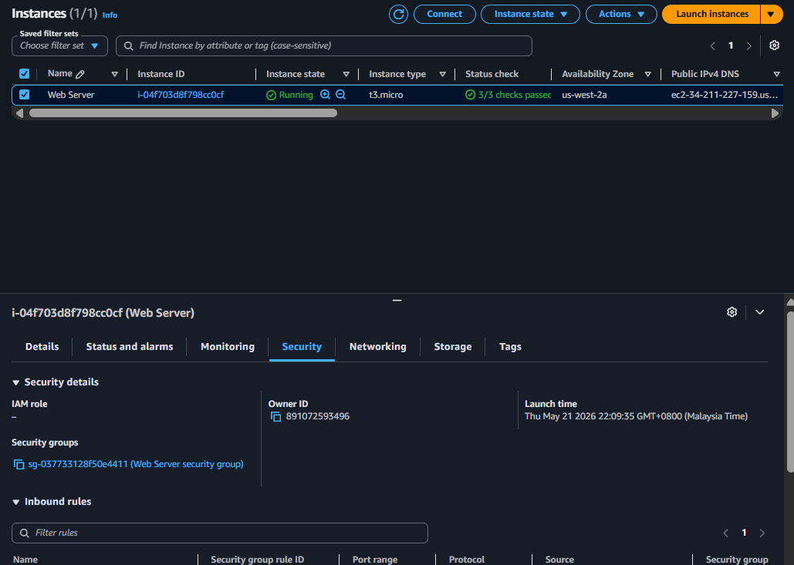
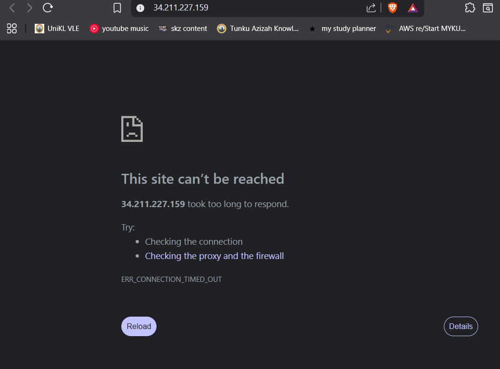
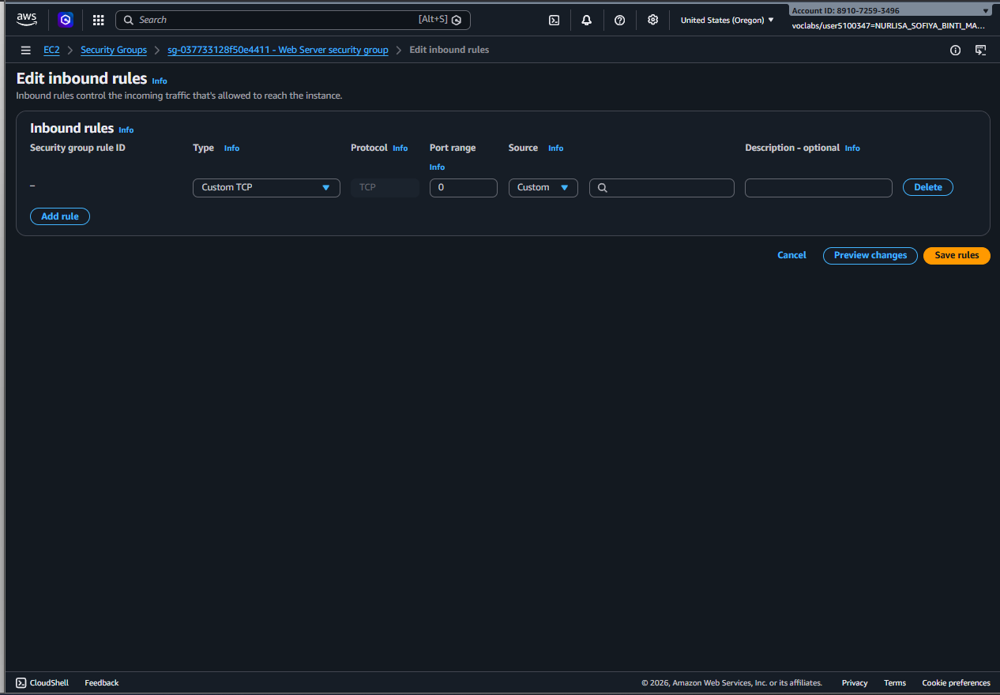
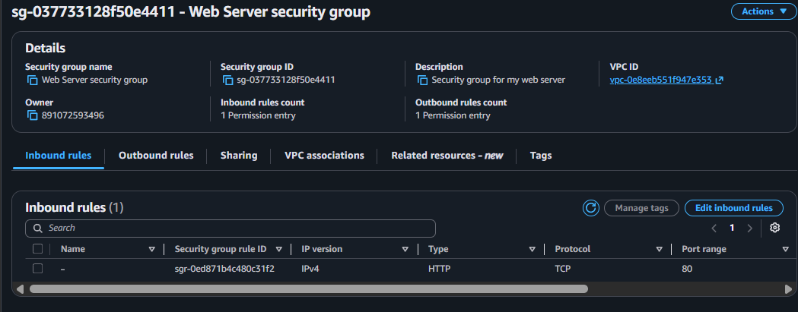
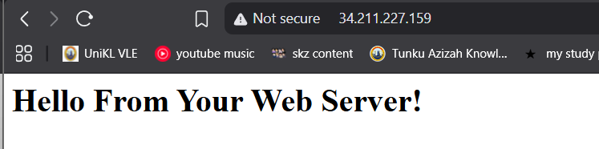
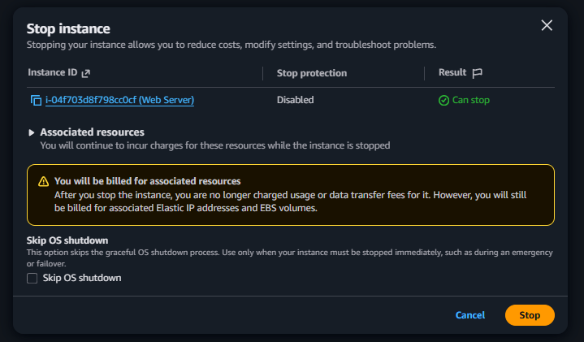
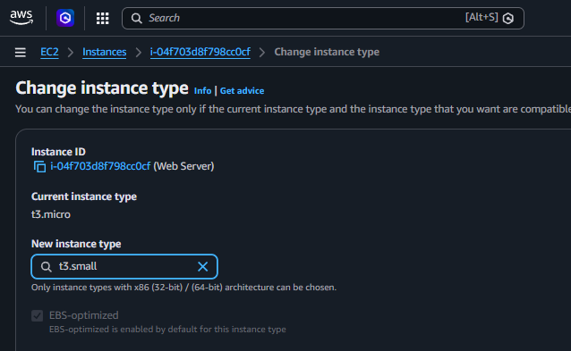

# Introduction to Amazon EC2 ☁️

## 📌 Overview

This lab introduces the basics of launching, monitoring, securing, and resizing an Amazon EC2 instance using Amazon Web Services. The objective is to understand how virtual servers work in the cloud and how to manage them through the AWS Management Console.

---

# 🚀 Task 1 — Launching an EC2 Instance

## Objective

Create and launch a virtual machine using Amazon EC2.

## Activities

* Selected Amazon Machine Image (AMI)
* Chose instance type (`t3.micro`)
* Configured security settings
* Added user data script
* Launched EC2 instance
* Verified instance status

## Expected Screenshots

* Launch Instance page
  

* Instance configuration
  

* Running instance dashboard
  

* Status checks passed
  

---

# 🔐 Task 2 — Configure Security Group & Access Web Server

## Objective

Allow HTTP traffic to access the hosted web server.

## Activities

* Copied Public IPv4 address
* Attempted web access before rule configuration
* Edited inbound security group rules
* Added HTTP rule (Port 80)
* Refreshed browser to verify web server access

## Expected Screenshots

* Browser connection failure
  

* Inbound rules configuration
  

* Added HTTP rule
  

* “Hello From Your Web Server!” webpage
  

---

# ⚙️ Task 3 — Resize EC2 Instance & EBS Volume

## Objective

Modify EC2 resources based on workload requirements.

## Activities

### Instance Resize

* Stopped EC2 instance
* Changed instance type from `t3.micro` to `t3.small`

### Restart Instance

* Started resized instance
* Verified successful startup

## Expected Screenshots

* Stop instance page
  

* Change instance type window
  

---

# 🧠 Skills Gained

* **Cloud Infrastructure Deployment:** Configuring, provisioning, and launching virtual machines (EC2) using the AWS Management Console.
* **Network Security Configuration:** Setting up Security Groups and editing inbound rules to allow specific web traffic (HTTP Port 80).
* **Resource Scaling:** Managing instance lifecycles by stopping, resizing (modifying instance types), and restarting instances to meet changing workload requirements.
* **Bootstrapping:** Using user data scripts to automate the installation and configuration of a web server during the initial instance launch.

---

# ✅ Conclusion

This lab provided hands-on experience with launching and managing an EC2 instance in Amazon Web Services. Key skills learned include instance deployment, monitoring, security configuration, and resource scaling within a cloud environment.
